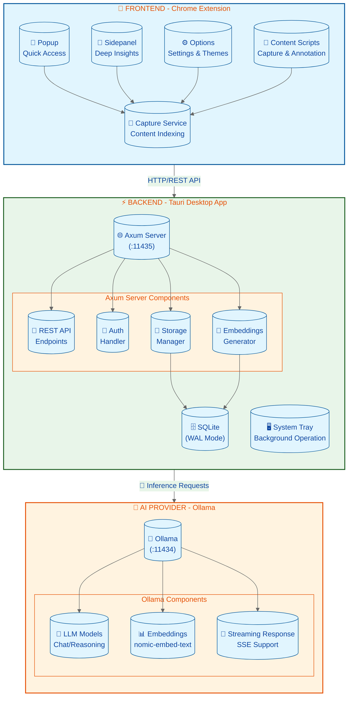

# 🌐 INTERNET MEMORY

### A Local, Privacy-First Knowledge Engine

*Transform your browsing into a crystalline, queryable intelligence.*

[](https://github.com/Flaxmbot/Second-Brain/releases)
[](LICENSE)
[
[](https://tauri.app)
[](https://react.dev)
[](https://www.rust-lang.org)

---

<a href="https://github.com/Flaxmbot/Second-Brain/stargazers">

</a>
<a href="https://github.com/Flaxmbot/Second-Brain/forks">

</a>

> **Your personal AI-powered memory that works 100% offline.**

</div>

---

## 📖 Description

**Internet Memory** (also known as *Second Brain*) is a powerful Chrome Extension + Desktop App combination that transforms how you capture, organize, and interact with online content. Built with privacy at its core, everything stays local on your machine.

- 🔒 **100% Local** - Your data never leaves your device
- 🧠 **AI-Powered** - Smart extraction and conversational AI with Ollama
- ⚡ **Fast & Efficient** - Lightweight Tauri backend with Rust
- 🎯 **Privacy First** - Zero cloud, zero telemetry

---

## ✨ Features

| | | |
|:--|:--|:--|
| 🧠 **Smart Knowledge Extraction** | 📺 **Multi-Media Support** | 🤖 **AI-Powered Categorization** |
| Automatically captures and indexes web articles while filtering out noise. | Native transcript extraction for YouTube and text recovery for PDFs. | Auto-detects topics (AI/ML, Finance, Dev) using local AI models. |
| 📊 **Knowledge Heatmap** | 💬 **Conversational Intelligence** | 🔗 **Numbered Citations** |
| Visual GitHub-style contribution grid of your reading habits. | Chat with your entire library using local LLMs via Ollama. | Every AI response includes linked sources for verifiable truth. |
| 🎨 **Premium UI** | 🔒 **Privacy First** | 🔍 **Full-Text Search** |
| Dynamic Light, Dark, and System themes with customizable accent colors. | 100% local storage. Zero cloud. Zero telemetry. Your data stays yours. | Powerful search across all your saved content with instant results. |

---

## 🏗️ Architecture



---

## ⚡ Quick Start

### Prerequisites

Before installing Internet Memory, ensure you have the following:

| Requirement | Version | Notes |
|------------|---------|-------|
| **Node.js** | ≥ 18.0 | For building the frontend |
| **Rust** | ≥ 1.70 | For Tauri backend |
| **Ollama** | Latest | [Download](https://ollama.ai/) |
| **Browser** | Chrome/Edge 110+ | For the extension |

### Installation

#### 1. Clone the Repository

```bash
git clone https://github.com/Flaxmbot/Second-Brain.git
cd Second-Brain
```

#### 2. Install Dependencies

```bash
# Install Node.js dependencies
npm install

# Install Rust dependencies
cd src-tauri
cargo install --locked
```

#### 3. Pull Ollama Models

```bash
# Pull the embedding model (required)
ollama pull nomic-embed-text

# Pull a chat model (recommended)
ollama pull llama3.2
```

#### 4. Build & Run

```bash
# Development mode
npm run tauri dev

# Production build
npm run tauri build
```

#### 5. Install Browser Extension

1. Open `chrome://extensions`
2. Enable **Developer mode** (top right)
3. Click **Load unpacked**
4. Select the `extension/` folder from your project

#### 6. Authenticate

1. Right-click the extension icon → **Options**
2. Enter the API Token from the Tauri app system tray menu
3. Click **Save**

---

## 📥 Download

Choose your platform:

| Platform | Architecture | Download |
|----------|--------------|----------|
| 🪟 **Windows** | x64 | [Download .exe](https://github.com/Flaxmbot/Second-Brain/releases) |
| 🍎 **macOS** | Apple Silicon (M1/M2/M3) | [Download .dmg](https://github.com/Flaxmbot/Second-Brain/releases) |
| 🍎 **macOS** | Intel | [Download .dmg](https://github.com/Flaxmbot/Second-Brain/releases) |
| 🐧 **Linux** | AppImage | [Download .AppImage](https://github.com/Flaxmbot/Second-Brain/releases) |
| 🐧 **Linux** | Debian | [Download .deb](https://github.com/Flaxmbot/Second-Brain/releases) |
| 🐧 **Linux** | RPM | [Download .rpm](https://github.com/Flaxmbot/Second-Brain/releases) |

---

## 🛠️ Tech Stack

<div align="center">

| Category | Technology | Description |
|----------|------------|-------------|
| 💻 **Backend** |  **Rust** | High-performance backend with memory safety |
| 🪟 **Framework** |  **Tauri v2** | Lightweight desktop app framework |
| 🎨 **Frontend** |  **React 19** | Modern UI library with hooks |
| 🎭 **Styling** |  **CSS3** | Custom properties & animations |
| 🗄️ **Database** |  **SQLite** | Local ACID-compliant storage |
| 🤖 **AI/ML** |  **Ollama** | Local LLM & embeddings inference |
| 🌐 **Server** |  **Axum** | Ergonomic Rust web framework |
| 🔌 **Extension** |  **Web Extensions** | Cross-browser extension API |

</div>

---

## 🤝 Contributing

Contributions are what make the open-source community such an amazing place to learn, inspire, and create. Any contributions you make are **greatly appreciated**!

### Ways to Contribute

| Method | Description |
|--------|-------------|
| 🐛 **Report Bugs** | Open an issue with detailed reproduction steps |
| 💡 **Request Features** | Suggest new functionality |
| 📖 **Improve Documentation** | Fix typos, add examples |
| 🔧 **Submit PRs** | Fork the repo and submit improvements |

### Development Setup

```bash
# Fork the repository
# Clone your fork
git clone https://github.com/YOUR_USERNAME/Second-Brain.git

# Create a feature branch
git checkout -b feature/amazing-feature

# Make your changes and commit
git commit -m 'Add some amazing feature'

# Push to the branch
git push origin feature/amazing-feature

# Open a Pull Request
```

Please read our [Contributing Guidelines](CONTRIBUTING.md) for details.

---

## 📄 License

<div align="center">

[](LICENSE)

**Internet Memory** is open source under the [MIT License](LICENSE).

Copyright © 2024-present [Flaxmbot](https://github.com/Flaxmbot)

---

*Built with ❤️ by [Flaxmbot](https://github.com/Flaxmbot)*

</div>
