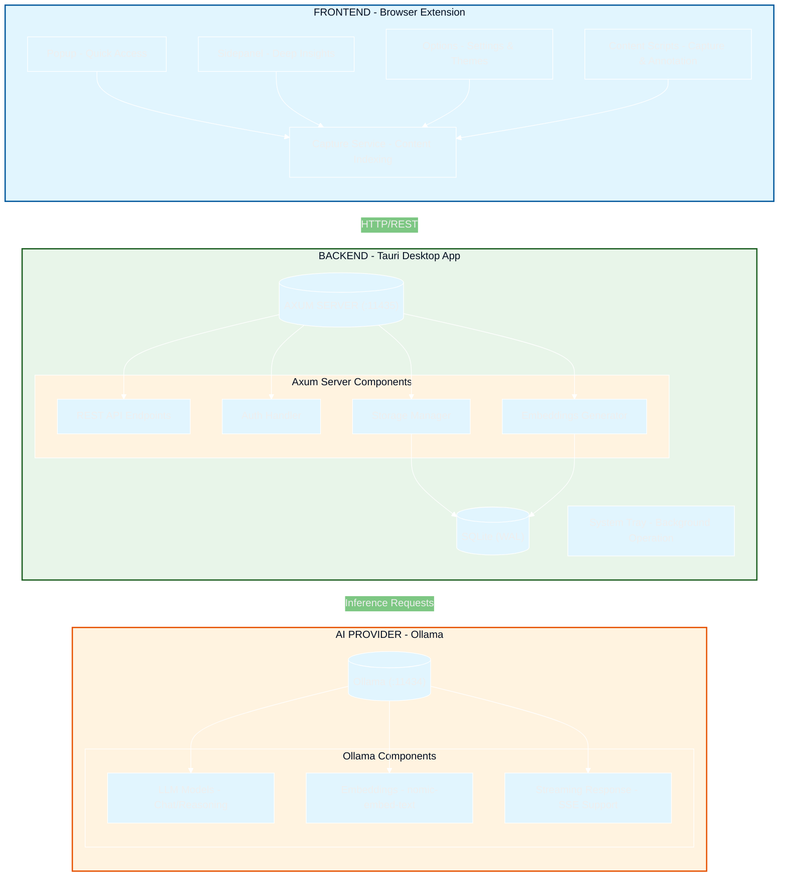

<!--
  ═══════════════════════════════════════════════════════════════════════════════
  🧠 INTERNET MEMORY - A Local, Privacy-First Knowledge Engine
  ═══════════════════════════════════════════════════════════════════════════════
-->

<div align="center">

<!-- Animated Gradient Banner -->
<picture>
  <source media="(prefers-color-scheme: dark)" srcset="https://capsule-render.vercel.app/api?type=waving&height=300&color=0:1a1a2e,20:16213e,40:0f3460,60:e94560,80:533483,100:1a1a2e&animation=twinkling&text=Internet%20Memory&fontSize=80&fontAlignY=40&desc=Your%20Local%20Privacy-First%20Knowledge%20Engine&descAlignY=55&descSize=30&bgHeight=300">
  
</picture>

<!-- Version, License, Platform Badges -->
<p>


</p>

<!-- Star Count Placeholder -->
<p>
<a href="https://github.com/Flaxmbot/Second-Brain/stargazers">

</a>
<a href="https://github.com/Flaxmbot/Second-Brain/forks">

</a>
</p>

<!-- Tagline -->
> **Transform your browsing into a crystalline, queryable intelligence.**
> *Your personal AI-powered memory that works 100% offline.*

</div>

---

<!-- Badges Section -->
<div align="center">

### 🛠️ Built With


</div>

---

## ✨ Features

<div class="features-grid">

| | |
|:--|:--|
| <div align="center">🧠<br><strong>🧠 Smart Knowledge Extraction</strong><br>Automatically captures and indexes web articles while filtering out noise.</div> | <div align="center">📺<br><strong>📺 Multi-Media Support</strong><br>Native transcript extraction for YouTube and text recovery for PDFs.</div> |
| <div align="center">🤖<br><strong>🤖 AI-Powered Categorization</strong><br>Auto-detects topics (AI/ML, Finance, Dev) using local AI models.</div> | <div align="center">📊<br><strong>📊 Knowledge Heatmap</strong><br>Visual GitHub-style contribution grid of your reading habits.</div> |
| <div align="center">💬<br><strong>💬 Conversational Intelligence</strong><br>Chat with your entire library using local LLMs via Ollama.</div> | <div align="center">🔗<br><strong>🔗 Numbered Citations</strong><br>Every AI response includes linked sources for verifiable truth.</div> |
| <div align="center">🎨<br><strong>🎨 Premium UI</strong><br>Dynamic Light, Dark, and System themes with customizable accent colors.</div> | <div align="center">🔒<br><strong>🔒 Privacy First</strong><br>100% local storage. Zero cloud. Zero telemetry. Your data stays yours.</div> |

</div>

---

## 🏗️ Architecture



---

## ⚡ Quick Start

### Prerequisites

Before installing Internet Memory, ensure you have the following:

| Requirement | Version | Notes |
|------------|---------|-------|
| **Node.js** | ≥ 18.0 | For building the frontend |
| **Rust** | ≥ 1.70 | For Tauri backend |
| **Ollama** | Latest | [Download](https://ollama.ai/) |
| **Browser** | Chrome/Edge 110+ | For the extension |

### Installation

#### 1. Clone the Repository

```bash
git clone https://github.com/Flaxmbot/Second-Brain.git
cd Second-Brain
```

#### 2. Install Dependencies

```bash
# Install Node.js dependencies
npm install

# Install Rust dependencies
cd src-tauri
cargo install --locked
```

#### 3. Pull Ollama Models

```bash
# Pull the embedding model (required)
ollama pull nomic-embed-text

# Pull a chat model (recommended)
ollama pull llama3.2
```

#### 4. Build & Run

```bash
# Development mode
npm run tauri dev

# Production build
npm run tauri build
```

#### 5. Install Browser Extension

1. Open `chrome://extensions`
2. Enable **Developer mode** (top right)
3. Click **Load unpacked**
4. Select the `extension/` folder from your project

#### 6. Authenticate

1. Right-click the extension icon → **Options**
2. Enter the API Token from the Tauri app system tray menu
3. Click **Save**

---

## 📥 Download

Choose your platform:

| Platform | Status | Download Link |
|----------|--------|---------------|
| 🪟 **Windows (x64)** | Available | [Download .exe](https://github.com/Flaxmbot/Second-Brain/releases) |
| 🍎 **macOS (Apple Silicon)** | Available | [Download .dmg](https://github.com/Flaxmbot/Second-Brain/releases) |
| 🍎 **macOS (Intel)** | Available | [Download .dmg](https://github.com/Flaxmbot/Second-Brain/releases) |
| 🐧 **Linux (AppImage)** | Available | [Download .AppImage](https://github.com/Flaxmbot/Second-Brain/releases) |
| 🐧 **Linux (.deb)** | Available | [Download .deb](https://github.com/Flaxmbot/Second-Brain/releases) |

---

## 🛠️ Tech Stack

<div align="center">

| Category | Technology | Description |
|----------|------------|-------------|
| **Core Engine** |  **Rust** | High-performance backend with memory safety |
| **Framework** |  **Tauri v2** | Lightweight desktop app framework |
| **Frontend** |  **React 19** | Modern UI library with hooks |
| **Styling** |  **CSS3** | Custom properties & animations |
| **Database** |  **SQLite** | Local ACID-compliant storage |
| **AI/ML** |  **Ollama** | Local LLM & embeddings inference |
| **Server** |  **Axum** | Ergonomic Rust web framework |
| **Extension** |  **Web Extensions** | Cross-browser extension API |

</div>

---

## 🤝 Contributing

Contributions are what make the open-source community such an amazing place to learn, inspire, and create. Any contributions you make are **greatly appreciated**!

### Ways to Contribute

1. **🐛 Report Bugs** - Open an issue with detailed reproduction steps
2. **💡 Request Features** - Suggest new functionality
3. **📖 Improve Documentation** - Fix typos, add examples
4. **🔧 Submit PRs** - Fork the repo and submit improvements

### Development Setup

```bash
# Fork the repository
# Clone your fork
git clone https://github.com/YOUR_USERNAME/Second-Brain.git

# Create a feature branch
git checkout -b feature/amazing-feature

# Make your changes and commit
git commit -m 'Add some amazing feature'

# Push to the branch
git push origin feature/amazing-feature

# Open a Pull Request
```

Please read our [Contributing Guidelines](CONTRIBUTING.md) for details.

---

## 📄 License

<div align="center">

[](LICENSE)

**Internet Memory** is open source under the [MIT License](LICENSE).

Copyright © 2024-present [Flaxmbot](https://github.com/Flaxmbot)

</div>

---

<div align="center">

<!-- Animated Separator -->

<table>
<tr>
<td>

---

*Built with ❤️ by [Flaxmbot](https://github.com/Flaxmbot)*

</td>
</tr>
</table>

<table>
<tr>
<td align="center">

</td>
</tr>
</table>

</div>
