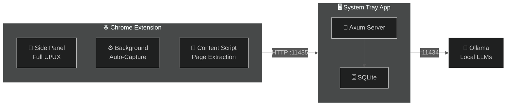

<div align="center">

<!-- Animated Typing Header via readme-typing-svg -->
<a href="https://github.com/Flaxmbot/Second-Brain">
  
</a>

<br/>


<br/><br/>

[](https://github.com/Flaxmbot/Second-Brain/releases)
[](LICENSE)
[](https://github.com/Flaxmbot/Second-Brain/releases)

[](https://tauri.app)
[](https://www.rust-lang.org)
[](https://developer.chrome.com/docs/extensions/mv3/)
[](https://ollama.ai/)

<br/>

<a href="https://github.com/Flaxmbot/Second-Brain/stargazers">
  
</a>
<a href="https://github.com/Flaxmbot/Second-Brain/forks">
  
</a>

</div>

<!-- Animated gradient divider -->
<p align="center">
  
</p>

## 🧬 What is Internet Memory?

> **A Chrome extension + lightweight system-tray backend that automatically captures, indexes, and lets you chat with everything you read online — powered by local AI.**

The desktop app runs silently in your **system tray**, serving as a mediator between the Chrome extension and your local Ollama instance. All UI/UX lives in the **browser extension's side panel**.

<table>
<tr>
<td width="50%">

### 🔒 Privacy by Design
- 100% local — your data **never** leaves your machine
- Zero cloud, zero telemetry, zero tracking
- SQLite database stored in your app data folder
- Authentication via API token (copy from tray icon)

</td>
<td width="50%">

### ⚡ How It Works
1. **Browse** the web normally
2. Extension **automatically captures** articles you read
3. Backend **embeds & indexes** content via Ollama
4. **Chat with your knowledge** from the extension side panel

</td>
</tr>
</table>

<p align="center">
  
</p>

## ✨ Features

<table>
<tr>
  <td align="center" width="33%">
    <h3>🧠 Smart Capture</h3>
    <p>Auto-captures articles, filters noise, deduplicates URLs. Supports articles, YouTube transcripts, PDFs, GitHub repos.</p>
  </td>
  <td align="center" width="33%">
    <h3>💬 Chat with Memory</h3>
    <p>Ask questions about everything you've read. Streaming AI responses with numbered source citations.</p>
  </td>
  <td align="center" width="33%">
    <h3>🤖 Local AI</h3>
    <p>Powered by Ollama — embeddings via nomic-embed-text, chat via any local LLM. Nothing sent to the cloud.</p>
  </td>
</tr>
<tr>
  <td align="center" width="33%">
    <h3>📊 Knowledge Graph</h3>
    <p>Auto-extracted concepts and relationships visualized as an interactive D3 force graph.</p>
  </td>
  <td align="center" width="33%">
    <h3>🔥 Reading Heatmap</h3>
    <p>GitHub-style contribution grid showing your reading habits over the past year.</p>
  </td>
  <td align="center" width="33%">
    <h3>🔍 Semantic Search</h3>
    <p>Vector similarity + keyword search with optional AI reranking for best results.</p>
  </td>
</tr>
<tr>
  <td align="center" width="33%">
    <h3>🏷️ Auto-Categorization</h3>
    <p>AI detects topics (AI/ML, Finance, Dev, Science, Health) and categorizes automatically.</p>
  </td>
  <td align="center" width="33%">
    <h3>✏️ Highlights</h3>
    <p>Right-click any text → "Add to Internet Memory" to save annotated snippets.</p>
  </td>
  <td align="center" width="33%">
    <h3>📤 Import/Export</h3>
    <p>Full JSON export and import of your knowledge base for backup and migration.</p>
  </td>
</tr>
</table>

<p align="center">
  
</p>

## 🏗️ Architecture


> **Extension** handles all UI · **Tray App** is a headless mediator · **Ollama** provides AI

<p align="center">
  
</p>

## ⚡ Quick Start

### Prerequisites

| Requirement | Version | Purpose |
|:------------|:--------|:--------|
| **Ollama** | Latest | Local AI inference — [download here](https://ollama.ai/) |
| **Chrome / Edge** | 110+ | Browser with extension support |
| **Node.js** | ≥ 18 | Only for building from source |
| **Rust** | ≥ 1.70 | Only for building from source |

### Option A: Download Pre-built

<details>
<summary><b>📦 Download the latest release for your platform</b></summary>

| Platform | Architecture | Download |
|:---------|:-------------|:---------|
| 🪟 **Windows** | x64 | [Download .msi / .exe](https://github.com/Flaxmbot/Second-Brain/releases) |
| 🍎 **macOS** | Apple Silicon | [Download .dmg](https://github.com/Flaxmbot/Second-Brain/releases) |
| 🍎 **macOS** | Intel | [Download .dmg](https://github.com/Flaxmbot/Second-Brain/releases) |
| 🐧 **Linux** | x64 | [Download .deb / .AppImage / .rpm](https://github.com/Flaxmbot/Second-Brain/releases) |

</details>

### Option B: Build from Source

<details>
<summary><b>🔧 Build instructions</b></summary>

```bash
# Clone
git clone https://github.com/Flaxmbot/Second-Brain.git
cd Second-Brain

# Install dependencies
npm install

# Pull Ollama models
ollama pull nomic-embed-text   # Required — embeddings
ollama pull llama3.2           # Recommended — chat

# Development
npm run tauri dev

# Production build
npm run tauri build
```

</details>

### Install the Chrome Extension

1. Open `chrome://extensions`
2. Enable **Developer mode** (top right toggle)
3. Click **Load unpacked** → select the `extension/` folder
4. Right-click extension icon → **Options** → paste API token from tray menu

<p align="center">
  
</p>

## 🛠️ Tech Stack

<div align="center">

| Layer | Technology | Role |
|:------|:-----------|:-----|
| 🦀 **Backend** | Rust + Tauri v2 | System tray app, HTTP server |
| 🌐 **Server** | Axum | REST API on `:11435` |
| 🗄️ **Database** | SQLite (WAL) | Local ACID-compliant storage |
| 🤖 **AI** | Ollama | Local LLM + embeddings |
| 🔌 **Extension** | Chrome MV3 | Side panel UI, auto-capture |
| 🎨 **Extension UI** | HTML/CSS/JS | Side panel, options, popup |

</div>

<p align="center">
  
</p>

## 📡 API Reference

The tray app exposes a REST API on `http://localhost:11435`. All endpoints (except `/api/status`) require an `Authorization: Bearer <token>` header.

<details>
<summary><b>View all API endpoints</b></summary>

| Method | Endpoint | Description |
|:-------|:---------|:------------|
| `GET` | `/api/status` | Health check & Ollama status |
| `GET` | `/api/models` | List Ollama models |
| `POST` | `/api/capture` | Capture article content |
| `POST` | `/api/check-url` | Check if URL already captured |
| `POST` | `/api/query` | Query memory (non-streaming) |
| `POST` | `/api/query/stream` | Query memory (SSE streaming) |
| `GET` | `/api/articles` | List articles (paginated) |
| `GET` | `/api/articles/:id` | Get single article |
| `DELETE` | `/api/articles/:id` | Delete article |
| `GET` | `/api/timeline` | Timeline view |
| `GET` | `/api/stats` | Dashboard statistics |
| `GET` | `/api/graph` | Knowledge graph data |
| `GET` | `/api/heatmap` | Reading heatmap |
| `GET` | `/api/categories` | Category breakdown |
| `GET` | `/api/related/:id` | Related articles |
| `POST` | `/api/highlights` | Save highlight |
| `GET` | `/api/highlights/:id` | Get highlights for article |
| `GET` | `/api/settings` | Get settings |
| `POST` | `/api/settings` | Update settings |
| `GET` | `/api/export` | Export all data (JSON) |
| `POST` | `/api/import` | Import data (JSON) |
| `GET` | `/api/conversations` | List conversations |
| `POST` | `/api/conversations` | Create conversation |
| `GET` | `/api/conversations/:id/messages` | Get conversation messages |

</details>

<p align="center">
  
</p>

## 🤝 Contributing

Contributions are welcome! See [CONTRIBUTING.md](CONTRIBUTING.md) for guidelines.

| How | Description |
|:----|:------------|
| 🐛 **Report Bugs** | [Open an issue](https://github.com/Flaxmbot/Second-Brain/issues) with reproduction steps |
| 💡 **Request Features** | Suggest new functionality |
| 🔧 **Submit PRs** | Fork → branch → commit → PR |

<p align="center">
  
</p>

<div align="center">

## 📄 License

[](LICENSE)

**Internet Memory** is open source under the [MIT License](LICENSE).

Copyright © 2024-present [Flaxmbot](https://github.com/Flaxmbot)

---


</div>
